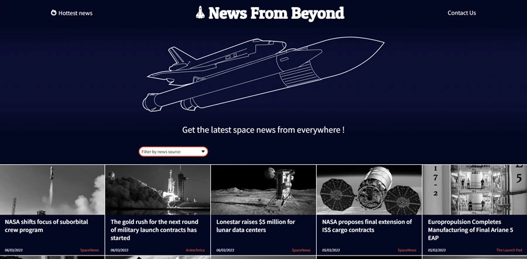

# Repaire du Web - Contest #4

## Use an API

Create an app using an API

### My goals

I choose a space news API, and create an entire universe around it.

I wanted to test multiple technics with this project :

- svg animation
- masonry layout
- infinite scroll

I've dropped masonry layout because articles were to difficult to read with this layout. But I've kept the JS script for futur project (a simple JS script with no libraries found [here](https://medium.com/@andybarefoot/a-masonry-style-layout-using-css-grid-8c663d355ebb)).

### Technologies

- HTML
- SASS
- Vanilla JS

### Challenges

One of the challenges was to deal with mutliple news card height, depending on the title length. I use flexbox and multiple container to make smaller cards to use the entire available space (and keep date and source infos at the bottom).

This project was the first time I used svg path animations. I've created the large space shuttle and loading icon on my own, and I had to redo the loading icon multiple times to have an animation that suited me.
Even if I've liked the effect, I'm planning to remove part (or all) of them to limit motion distraction (especially at the page loading).

### Further possible improvements

#### Dropdown filter

- only show sources with visible articles (and not all possible API sources)
- enable multiple sources selection, showed with 'pills' buttons on the dorpdown side
- remove a source filter on button click (with a little cross icon)

#### Articles

- allow to show the article summary on article card click
- expand the article card on summary show
- add a 'read more...' with artile external link, instead of linking with the title (as actual behavior)

#### General

- add accessibility features (no animation if reduce-motion, tab selection ...)
- improve responsivness
- add a fixed header on scroll

### Sources

- [API Spaceflight News API](https://www.spaceflightnewsapi.net/)

### Preview

